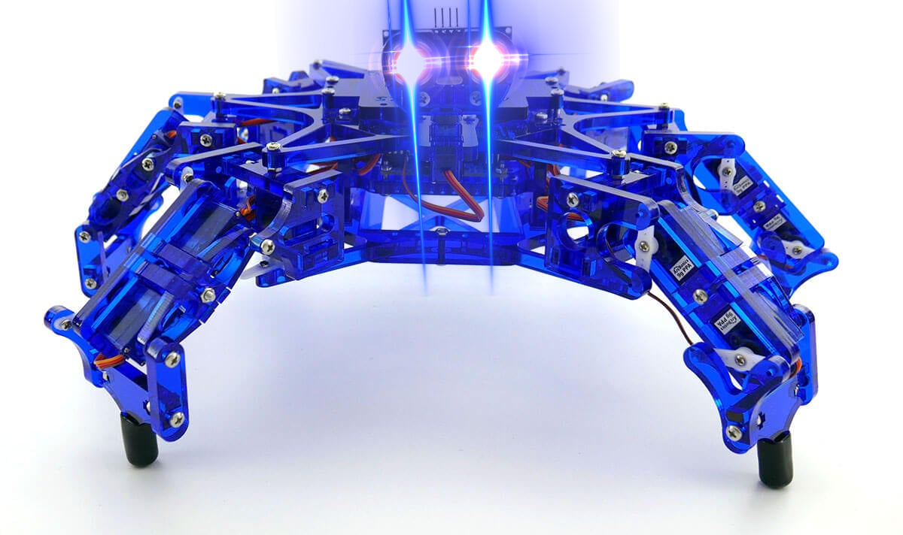
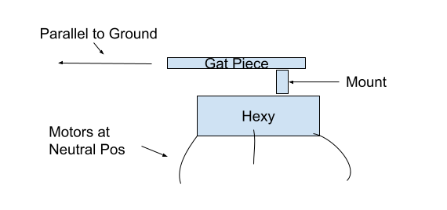
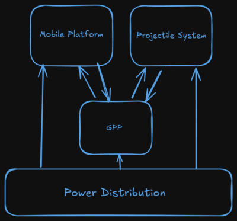

# Angry Hexy

Hexy is a hexapod robotics kit from Arcbotics. Its a great little robot kit with one glaring deficiency. That is, it does not have the ability to shoot projectiles from a back mounted nerf gun. In this project we address the Hexy's one and only short coming.



# System-Wide Definitions / Requirements

1) The system is composed of two primary subsystems the **Mobile Platform** (Hexy) and the **Projectile System** (Nerf Gun).

2) The Projectile System shall be mounted to the Mobile Platform such that when the Mobile Platform's actuators are at their **zero position** the Projectile System is pointing at an elevation of 0 radians relative to the horizon.
    
    1) This mounting piece should probably be adjustable.



3) While stationary, the nerf gun will be aimed by moving actuators on the hexy.

    1) Will need to develop a model of how actuating the hexy changes the point of aim of nerf gun. Maybe a laser system on a grid paper at a fixed distance and we can measure the curves created by moving the stationary hexy?

4) For now ignore shooting and moving so that the only requirement on motion is to be able to tell the hexy to go to a position, stop and then engage in shooting.

5) In addition to the two primary systems (Hexy and Nerf) there are two secondary subsystems, these are **Power Distribution** and the **GPP**.

    1) The hexy and nerf will provide sensor data / telemetry to the GPP and the GPP will either directly interface with actuators on these primary systems or will communicate with a micro controller on these primary systems using some to be specified protocol.

    2) Power Distribution simply supplies power to each of the other systems.

    3) The mounting of the GPP and power distribution is to be specified and its ultimate mounting solution is of minor concern.



# Software

* Just install raspian-lite with rpi-imager
* GPIO library is built in and one can use the following to turn a servo from a terminal:

```
python3
gpio_bcm_num=18
from gpiozero import AngularServo
servo = AngularServo(gpio_bcm_num, min_pulse_width=0.0006, max_pulse_width=0.0023)
```

* To set up remote camera service [follow this](https://www.instructables.com/How-to-Make-Raspberry-Pi-Webcam-Server-and-Stream-/)
    * control port on 6969
    * stream port on 6970
    * Turn off picture and movie capture
    * Frames to like 10
* On reboot to start up `sudo service motion start` and `sudo motion`