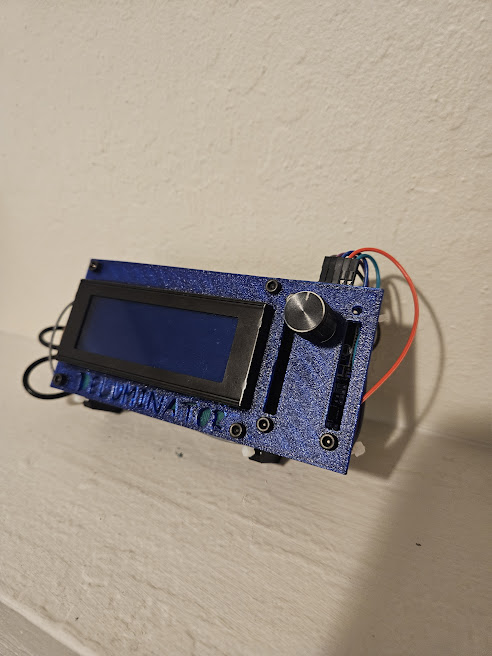

# ESP 32 Deluminator

Welcome to the ESP 32 Deluminator project. The name is a reference to Dumbledor's light snatching deluminator from the harry potter series. We have 3 very specific goals in mind as it relates to this project.

* (1) Create an esp32 device that can carry out various wifi based attacks on our home network. Specifically one that specializes in collecting encrypted WPA2 PSKs and other packet logging / sniffing based attacks.
* (2) Explore the wifi 802.11 protocol and internal workings of this medium
* (3) Explore the HW and programming model of the ESP32

# Disclaimer

We do not support or condone the use of any attacks on non consenting parties. Please only do this on your own hardware or on systems that you have been given rights to attack.

# Usage

* Set up the esp-idf build env as we describe [here](https://github.com/tanner-johnson2718/PI_JTAG_DBGR/blob/master/writeups/Init_PI_JTAG_Test.md#esp-32-set-up). This also describes flashing of the device.
* The main interface for the system is the repl, which can be connected to via:
    * USB serial (`idf.py -p /dev/ttyUSB0 monitor`) OR
    * REPL TCP server (`nc 192.168.4.1 421`) (these settings can be changed in the menuconfig)
    * Through the repl one can interface, start, stop, and configure the main components.
* Type `help` on the serial ot net repl to see all possible commands
* Documentation can be found in `main.c` and in every components header file.

## Typical Attack Flow

# 3D printed Case for v0.2+ (NO UI)

# Wiring and 3D Printed Case for v0.1 LCD version

Our initial prototypa had an lcd and rotary encoder. The code for this is archived at tag v0.1, but we found that 1 it was bulky and 2 it was easier to run the system from the repl. 

| ESP Pin | LCD / ROT Pin | Func |
| --- | --- | --- |
| 26 | SCL | SCL |
| 25 | SDA | SDA |
| Vin | LCD+ | Vin |
| GND | LCD- | GND |
| 33 | Rot Switch | Button Pin |
| GND | Rot Switch | Button Pin GND |
| 32 | Rot A Term | - |
| 27 | Rot B Term | - |
| GND | Rot Middle term | - |
| 3.3v | Rot Vin | - |

## BOM

* [ESP32 Wroom Dev Kit](https://www.amazon.com/gp/product/B08246MCL5/ref=ppx_yo_dt_b_search_asin_title?ie=UTF8&psc=1)
* [LCD 2004 w/ i2c backpack](https://www.amazon.com/dp/B0C1G9GBRZ?psc=1&ref=ppx_yo2ov_dt_b_product_details)
* [Battery Pack](https://www.walmart.com/ip/onn-Portable-Battery-4k-mAh-Black/934734622?wmlspartner=wlpa&selectedSellerId=0&wl13=2070&adid=22222222277934734622_117755028669_12420145346&wmlspartner=wmtlabs&wl0=&wl1=g&wl2=c&wl3=501107745824&wl4=aud-2230653093054:pla-306310554666&wl5=9033835&wl6=&wl7=&wl8=&wl9=pla&wl10=8175035&wl11=local&wl12=934734622&wl13=2070&veh=sem_LIA&gclsrc=aw.ds&&adid=22222222237934734622_117755028669_12420145346&wl0=&wl1=g&wl2=c&wl3=501107745824&wl4=aud-2230653093054:pla-306310554666&wl5=9033835&wl6=&wl7=&wl8=&wl9=pla&wl10=8175035&wl11=local&wl12=934734622&veh=sem&gad_source=1&gclid=CjwKCAiA-bmsBhAGEiwAoaQNmpeMOc645RI29sXwDRy94ucsxWZd484QlGaFLX9-s_fhE79IKZzTjxoCHxQQAvD_BwE)
* [Rotary encoder](https://www.amazon.com/dp/B07F26CT6B?psc=1&ref=ppx_yo2ov_dt_b_product_details)

## TODO
* look into exactly what is happining when we crack
    * maybe make a python script for that
    * Only store pertinent eapol info
    * How do we decrypt traffic on a net
* IP Logger
* Mem and Perf analysis
* 3D printed case
* Typical Attack Flow